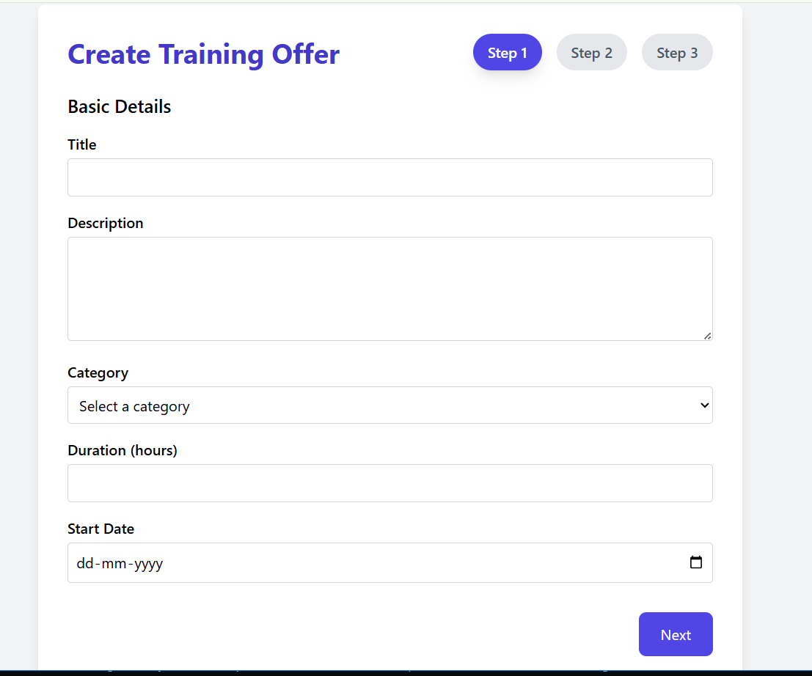

# NFT Certificate Project

## Problem Statement
In today's digital learning environment, verifying achievements and credentials is crucial. Traditional certificates can be easily forged and lack transparency. This project aims to provide a platform that combines learning, achievement, and verification by issuing blockchain-verified NFT certificates, ensuring authenticity and trust.

## Approach & Solution
The platform consists of a React frontend and an Express backend. The frontend offers routes for browsing courses, participating in hackathons and internships, taking quizzes, and viewing NFT certificates. The backend uses MongoDB for data storage, JWT for authentication, and integrates with blockchain technology via ethers.js to issue NFT certificates. This approach ensures a seamless user experience for learning and verifiable credential issuance.

## Features
- User authentication and profile management
- Course browsing, learning modules, and quizzes
- NFT certificates for course completion and hackathon participation
- Hackathon and internship management with team collaboration and submissions
- Admin panel for managing courses and users
- Anti-cheating mechanisms to ensure certificate integrity
- Blockchain verification of certificates for authenticity

## Tech Stack
- Frontend: React, React Router, Tailwind CSS, Framer Motion
- Backend: Node.js, Express, MongoDB, Mongoose, JWT, Multer
- Blockchain: ethers.js for NFT issuance and verification
- Other: bcryptjs for password hashing, cors for cross-origin requests, dotenv for environment variables

## Screenshots


### Course Preview


### Hackathon Certificates


### Additional UI


## Run Instructions

### Backend
1. Navigate to the backend directory:
   ```bash
   cd nft-certificate/backend
   ```
2. Install dependencies:
   ```bash
   npm install
   ```
3. Start the backend server in development mode:
   ```bash
   nodemon server.js
   ```
   The backend server will run on port 5000 by default.

### Frontend
1. Navigate to the frontend directory (assumed to be `nft-certificate` root):
   ```bash
   cd nft-certificate
   ```
2. Install dependencies:
   ```bash
   npm install
   ```
3. Start the frontend development server:
   ```bash
   npm start
   ```
4. Open your browser and go to `http://localhost:3000` to access the application.

---

This project provides a comprehensive platform for learning and earning blockchain-verified NFT certificates, enhancing trust and transparency in digital credentials.
